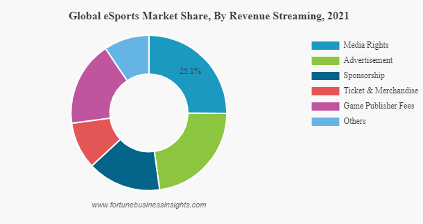

# E-Sports Analysis

## About
 - Competitive video gaming
 - Professional competitions
 - Types of games:
    - Strategy games
    - Fighting/Shooting games
    - Sports games
 - Fan and communities - source of entertainment

## Tags
#onlineGaming #streaming #prizes #engagement #social #entertainment #communities

## Reason for Rise (Potential factors to work for AR/VR)
 - Enhanced experience of games
 - growth of streaming platforms
 - Growth of revenue -> interested players
 - Ubiquity of devices and increase in the reach
 - Social Aspect of Watching Sports/Games/NFL/Super Bowl

## Surrounding Industries
 - Equipment
 - Insurance
 - Merchandise

||Revenue Streams||
|---|---|---|
|Prize Money|Sponsorships|Advertising|
|Ticket Sales|Broadcasting Rights|Merchandise|

Tickets and merchandise definitely have scope of improving.  
Viewership to cross 500 million[*](https://www.insiderintelligence.com/insights/esports-ecosystem-market-report/#:~:text=In%20the%20year%202022%2C%20there,competitors%20with%20data%2Ddriven%20research.)

## [:wolf: NCState Details :arrow_right:](https://github.com/kai-97/ESports-Analysis/blob/main/NCState.md)
